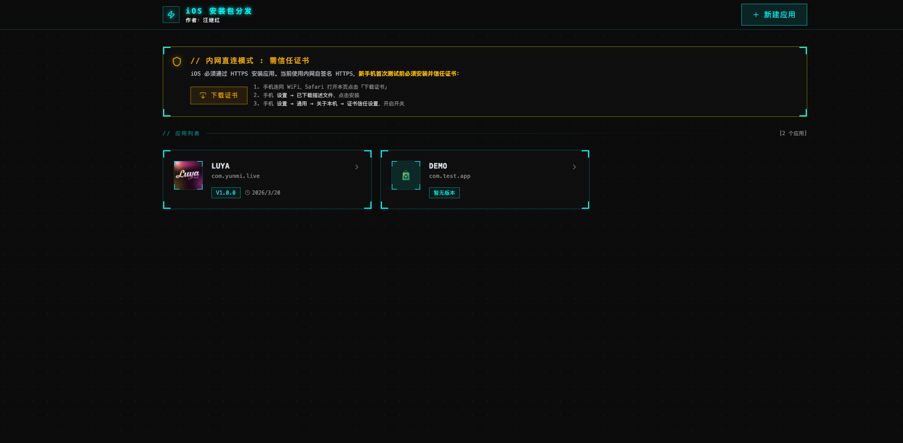
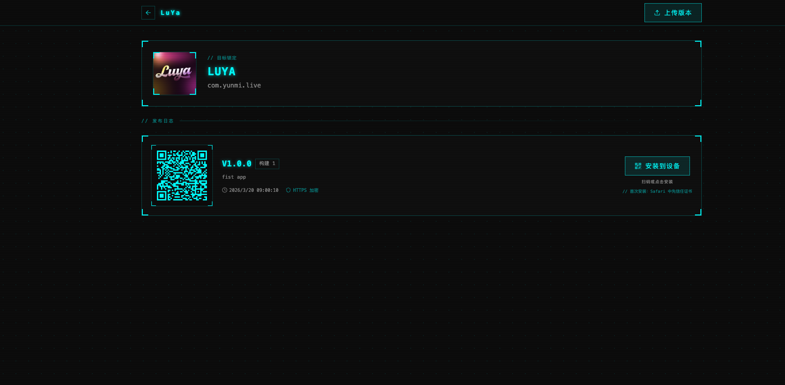
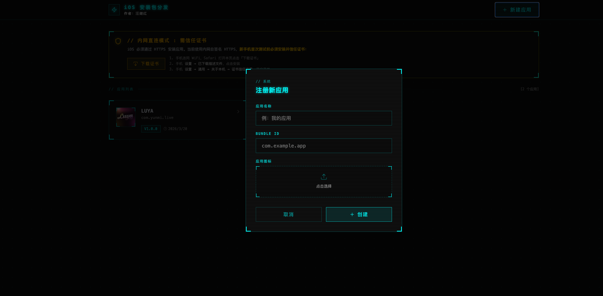

# iOS IPA 分发平台 (Local AppStore)

企业/团队内部 iOS 应用分发系统。上传 IPA 即可生成带二维码的安装页，手机扫码一键安装，无需 App Store 审核。

## 界面预览





---

## 两种部署模式

| 模式 | 场景 | 特点 |
|------|------|------|
| **宝塔面板反代**（推荐） | 公网/团队共享 | 真实域名 + Let's Encrypt 免费 SSL，手机无需信任证书 |
| **局域网直连** | 个人/开发调试 | 零依赖，自签名证书，手机需一次性信任 |

---

## 部署方案一：宝塔面板（公网，推荐）

> 以下以 **www.luya123.click** 为例。

### 1. 安装宝塔面板

```bash
# CentOS / RHEL
yum install -y wget && wget -O install.sh https://download.bt.cn/install/install_6.0.sh && sh install.sh ed8484bec

# Ubuntu / Debian
wget -O install.sh https://download.bt.cn/install/install-ubuntu_6.0.sh && bash install.sh ed8484bec
```

安装完成后打开面板地址，完成初始化。

---

### 2. 安装 Node.js 和 PM2

宝塔面板 → **软件商店** → 搜索 **Node.js 版本管理器** → 安装。

进入 Node.js 管理器，安装 **v20 LTS**（或 v18+），然后执行：

```bash
npm install -g pm2
```

---

### 3. 上传项目代码

```bash
# 宝塔默认网站目录
cd /www/wwwroot

# 方式一：git clone（推荐）
git clone <你的仓库地址> local-appstore
cd local-appstore

# 方式二：直接上传压缩包，通过宝塔文件管理器解压
```

安装依赖：

```bash
npm install
```

构建前端（生产模式必须）：

```bash
npm run build
```

---

### 4. 配置 .env

在项目根目录创建 `.env`：

```bash
# 对外访问地址（与 Nginx 域名一致，必须 https://）
APP_URL=https://www.luya123.click

# 生产模式（使用 dist 目录的编译前端）
NODE_ENV=production

# 告知服务器运行在反代后面，使用 HTTP 监听并信任代理 IP
BEHIND_PROXY=true

# 每个 App 最多保留的历史版本数（超出自动清理 IPA 文件）
KEEP_VERSIONS=5
```

---

### 5. 配置 Nginx 反向代理（宝塔面板）

宝塔面板 → **网站** → **添加站点**：
- 域名：`luya123.click` 和 `www.luya123.click`
- 根目录：随意（反代模式下不使用静态目录）

添加完成后，点击站点名称 → **配置文件**，将内容替换为：

```nginx
server {
    listen 80;
    server_name luya123.click www.luya123.click;
    return 301 https://www.luya123.click$request_uri;
}

server {
    listen 443 ssl http2;
    server_name luya123.click www.luya123.click;

    # SSL 证书（第 6 步申请后宝塔自动填入路径）
    ssl_certificate    /www/server/panel/vhost/cert/luya123.click/fullchain.pem;
    ssl_certificate_key /www/server/panel/vhost/cert/luya123.click/privkey.pem;

    ssl_protocols      TLSv1.2 TLSv1.3;
    ssl_ciphers        ECDHE-ECDSA-AES128-GCM-SHA256:ECDHE-RSA-AES128-GCM-SHA256:ECDHE-ECDSA-AES256-GCM-SHA384:ECDHE-RSA-AES256-GCM-SHA384;
    ssl_prefer_server_ciphers off;
    ssl_session_cache  shared:SSL:10m;
    ssl_session_timeout 1d;

    # ── 关键：允许大 IPA 上传 ────────────────────────────────────
    client_max_body_size 500M;
    client_body_timeout  300s;

    # ── 反向代理到 Node.js ──────────────────────────────────────
    location / {
        proxy_pass         http://127.0.0.1:3000;
        proxy_http_version 1.1;

        proxy_set_header   Host              $host;
        proxy_set_header   X-Real-IP         $remote_addr;
        proxy_set_header   X-Forwarded-For   $proxy_add_x_forwarded_for;
        proxy_set_header   X-Forwarded-Proto $scheme;
        proxy_set_header   Upgrade           $http_upgrade;
        proxy_set_header   Connection        "upgrade";

        # 上传/下载大文件时不在 Nginx 层缓冲，直接透传
        proxy_request_buffering  off;
        proxy_buffering          off;

        proxy_read_timeout  300s;
        proxy_send_timeout  300s;
        proxy_connect_timeout 10s;
    }

    # ── IPA 静态文件：流式下载，不缓冲 ────────────────────────
    location /uploads/ipas/ {
        proxy_pass         http://127.0.0.1:3000;
        proxy_http_version 1.1;
        proxy_set_header   Host            $host;
        proxy_set_header   X-Real-IP       $remote_addr;
        proxy_buffering    off;
        proxy_read_timeout 600s;
    }

    # ── 访问日志 ────────────────────────────────────────────────
    access_log  /www/wwwlogs/luya123.click.log;
    error_log   /www/wwwlogs/luya123.click.error.log;
}
```

保存后点击 **重启 Nginx**。

> **宝塔快捷方式**：也可在「反向代理」标签页可视化配置，再手动追加 `client_max_body_size` 等参数到配置文件。

---

### 6. 申请 SSL 证书（Let's Encrypt）

宝塔面板 → 网站 → 点击站点 → **SSL** → **Let's Encrypt** → 选择域名 → **申请**。

申请成功后勾选 **强制 HTTPS**，证书路径会自动写入 Nginx 配置。

---

### 7. 构建并用 PM2 启动

```bash
cd /www/wwwroot/local-appstore

# 首次部署（构建前端 + 启动服务器）
npm run deploy

# 之后用 PM2 托管（不再使用 deploy，避免每次重启都重新 build）
pm2 start npm --name "ipa-store" -- run start

# 保存进程列表，开机自启
pm2 save
pm2 startup   # 按提示执行输出的命令
```

**代码更新时**的标准流程：

```bash
git pull                    # 拉取新代码
npm install                 # 若 package.json 有变动
npm run build               # 重新构建前端
pm2 restart ipa-store       # 重启服务（秒级，不停机 build）
```

常用 PM2 命令：

```bash
pm2 list                  # 查看所有进程
pm2 logs ipa-store        # 查看日志
pm2 restart ipa-store     # 重启
pm2 stop ipa-store        # 停止
```

---

### 8. 验证部署

```bash
# 本机测试 Node 是否在监听
curl -s http://127.0.0.1:3000/api/apps

# 公网测试
curl -s https://www.luya123.click/api/apps
```

返回 JSON 数组即成功。打开 `https://www.luya123.click` 即可使用。

---

## 部署方案二：局域网直连（本地/开发）

手机和电脑在同一 WiFi 下，无需公网。

### 环境要求

- Node.js 18+（推荐用 [nvm](https://github.com/nvm-sh/nvm)）

```bash
curl -o- https://raw.githubusercontent.com/nvm-sh/nvm/v0.40.1/install.sh | bash
source ~/.zshrc
nvm install 20
nvm use 20
```

### 安装与启动

```bash
cd /path/to/local-appstore
npm install
npm run dev
```

终端会打印：

```
Server running on https://localhost:3000
  Phone install: https://192.168.x.x:3000
  Download cert: https://192.168.x.x:3000/api/install-cert
```

### 手机信任证书（首次）

1. 手机连同一 WiFi，Safari 打开 `https://192.168.x.x:3000/api/install-cert`
2. 提示下载描述文件 → 去**设置 → 已下载描述文件** → 安装
3. **设置 → 通用 → 关于本机 → 证书信任设置** → 开启该证书

之后扫码即可安装，无需重复操作（证书有效期 10 年）。

### 可选 .env 配置

```bash
# 固定 IP（省去每次启动后看终端）
APP_URL=https://192.168.1.100:3000

# 保留最近 N 个版本
KEEP_VERSIONS=5
```

---

## 数据文件

| 路径 | 说明 |
|------|------|
| `data.db` | SQLite 数据库（应用和版本信息） |
| `uploads/icons/` | 应用图标 |
| `uploads/ipas/` | IPA 文件 |

**换机迁移**：将 `data.db` 和 `uploads/` 拷到新机同目录，重启服务即可。

**清空所有数据**：

```bash
rm -f data.db
rm -rf uploads/
# 重启后自动重建
```

---

## 上传速度说明

上传采用 **10 MB 分片 + 4 路并发**策略：

- 单个 100 MB IPA 拆为 10 个分片，4 路同时上传，理论速度约为串行的 2-4 倍
- 分片失败仅重传该片，不影响已上传部分
- 进度条精度高（每完成一个分片更新一次）

> 实际速度取决于网络带宽。宝塔反代模式下已配置 `proxy_request_buffering off`，上传数据实时透传到 Node.js，不会因 Nginx 缓冲引入额外延迟。

---

## 常见问题

| 现象 | 处理 |
|------|------|
| 手机提示「无法安装」 | 确认用 HTTPS 访问；宝塔模式检查 Nginx 日志；本地模式检查证书是否信任 |
| 上传失败 / 超时 | 检查 Nginx `client_max_body_size`（需 ≥ IPA 文件大小）；`proxy_read_timeout` 建议 300s+ |
| 证书报错（本地模式） | 重新下载 `/api/install-cert` 并信任；或删除 `ssl/` 目录让服务重新生成 |
| 端口被占用 | `lsof -ti :3000 \| xargs kill -9` |
| PM2 启动失败 | `pm2 logs ipa-store` 查看详细错误；确认 `.env` 中 `NODE_ENV=production` 且已 `npm run build` |
| 域名无法访问 | 检查服务器安全组/防火墙是否放行 80/443 端口；宝塔面板 → 安全 → 放行端口 |

---

## 项目结构

```
├── server.ts          # Express 服务端（API + 静态文件）
├── src/
│   └── App.tsx        # React 前端
├── uploads/           # 上传文件（.gitignore 中）
├── ssl/               # 本地自签名证书（.gitignore 中）
├── data.db            # SQLite 数据库（.gitignore 中）
├── .env               # 环境配置（.gitignore 中）
└── dist/              # 构建产物（npm run build 生成）
```
