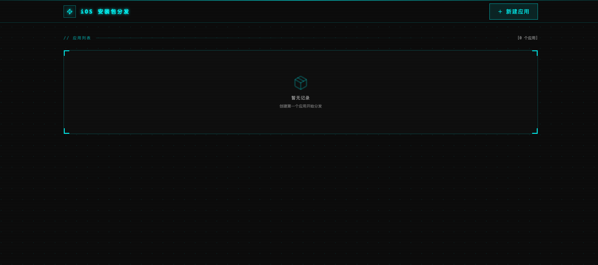
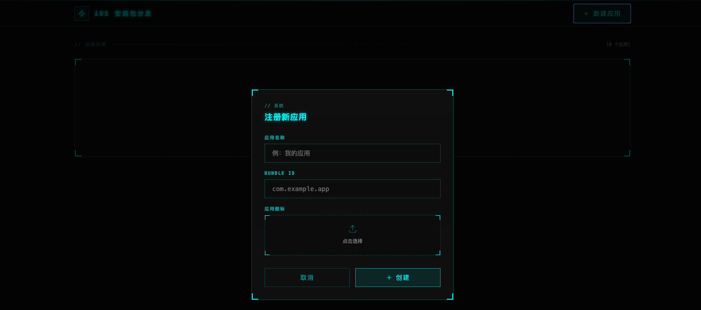

# iOS IPA 分发平台 (Local AppStore)

企业/团队内部 iOS 应用分发系统。上传 IPA 即可生成带二维码的安装页，手机扫码一键安装，无需 App Store 审核。

## 界面预览





---

## 两种部署模式

| 模式 | 场景 | 特点 |
|------|------|------|
| **宝塔面板 + PM2**（推荐） | 公网/团队共享 | 真实域名 + Let's Encrypt 免费 SSL，手机无需信任证书 |
| **局域网直连** | 个人/开发调试 | 零依赖，自签名证书，手机需一次性信任 |

---

## 部署方案一：宝塔面板 + PM2（公网，推荐）

Nginx 负责 HTTPS，Node.js 只在本机 `127.0.0.1:3000` 提供服务，PM2 负责进程守护和开机自启。

手机扫码安装 IPA **必须走 HTTPS**。宝塔 + Let's Encrypt 是推荐方案，手机不用额外信任自签名证书。

下文以域名 `www.example.com` 为例，请全程替换成你的真实域名。项目目录以 `/www/wwwroot/local-appstore` 为例。

### 架构

```
手机 / 浏览器
    │  HTTPS :443
    ▼
宝塔 Nginx（SSL、反向代理、大文件上传）
    │  HTTP 127.0.0.1:3000
    ▼
Node.js（tsx server.ts，PM2 守护）
    ├── dist/          前端静态资源（npm run build 生成）
    ├── data.db        SQLite
    └── uploads/       图标 + IPA
```

生产模式要点：

- `NODE_ENV=production` 时服务端读取 `dist/`，**不走 Vite 热更新**。改前端后必须重新 `npm run build`。
- `BEHIND_PROXY=true` 时进程只监听 `127.0.0.1`，SSL 交给 Nginx。
- `APP_URL` 会写进安装用的 `manifest.plist` 和二维码，必须和对外 HTTPS 地址完全一致。

不要用 `npm run deploy` 做线上启动。它等于 `build + start`，会在前台占住终端，也不受 PM2 管理。

### 准备

- 一台已能 SSH 登录的 Linux 服务器（CentOS / Ubuntu / Debian 均可）
- 一个已解析到该服务器公网 IP 的域名（A 记录指向服务器）
- 云厂商安全组 / 防火墙放行 **80** 和 **443**。**不要**把 3000 端口暴露到公网

### 1. 安装宝塔面板

SSH 登录服务器后执行对应系统的安装脚本：

```bash
# CentOS / RHEL
yum install -y wget && wget -O install.sh https://download.bt.cn/install/install_6.0.sh && sh install.sh ed8484bec

# Ubuntu / Debian
wget -O install.sh https://download.bt.cn/install/install-ubuntu_6.0.sh && bash install.sh ed8484bec
```

安装结束后记下面板地址、账号、密码，浏览器打开并完成初始化。建议在「软件商店」安装 **Nginx**。

### 2. 安装 Node.js 和 PM2

1. 宝塔 → **软件商店** → 搜索 **Node.js 版本管理器** → 安装
2. 打开 Node.js 管理器，安装 **v20 LTS**（最低 v18）
3. 在终端执行：

```bash
node -v          # 确认 >= 18
npm install -g pm2
pm2 -v
```

若 `node` 命令找不到，在 Node.js 管理器里把刚装的版本设为默认，然后重新打开 SSH。

### 3. 上传项目代码

```bash
cd /www/wwwroot
```

**方式一：Git（推荐）**

```bash
git clone <你的仓库地址> local-appstore
cd local-appstore
```

**方式二：压缩包**

用宝塔「文件」把项目 zip 上传到 `/www/wwwroot`，解压后目录名改为 `local-appstore`。不要把本地的 `node_modules/`、`dist/`、`data.db`、`uploads/` 一并上传（空项目首次部署不需要这些）。

安装依赖：

```bash
cd /www/wwwroot/local-appstore
npm install
```

### 4. 配置生产环境变量

生产启动脚本是 `NODE_ENV=production tsx server.ts`，服务端会按顺序加载：

1. `.env.production`
2. `.env`（只补充尚未设置的变量）

在项目根目录创建 `.env.production`（可复制仓库里的 `.env.production.example`）：

```bash
cd /www/wwwroot/local-appstore
cp .env.production.example .env.production
```

编辑为：

```bash
# 必须 true：只监听 127.0.0.1，SSL 由 Nginx 处理
BEHIND_PROXY=true

# 对外访问地址，必须 https://，不要末尾斜杠，必须和浏览器实际打开的域名一致
APP_URL=https://www.example.com

# 每个 App 最多保留的历史版本数，超出后自动删除旧 IPA
KEEP_VERSIONS=10

# 可选。删除应用/版本时的口令，不设则使用代码内默认值
# DELETE_PASSCODE=your-passcode

# 可选。默认 3000，改了这里就必须同步改 Nginx 的 proxy_pass
# PORT=3000
```

`.env.production` 已在 `.gitignore` 中，不要提交到 Git。

### 5. 构建前端

生产模式只提供 `dist/` 里的编译结果：

```bash
cd /www/wwwroot/local-appstore
npm run build
```

成功后应出现 `dist/index.html`。没有这一步，页面会空白或 404。

### 6. 添加网站并申请 SSL

**添加站点**

宝塔 → **网站** → **添加站点**：

- 域名：`example.com` 和 `www.example.com`（按你的解析填写）
- 根目录：可保持默认。反代后不会用这个目录提供页面
- PHP：纯静态 / 无 PHP 即可

**申请证书**

站点创建后先申请证书，避免手写证书路径出错：

1. 点进站点 → **SSL** → **Let's Encrypt**
2. 勾选需要的域名 → **申请**
3. 申请成功后勾选 **强制 HTTPS**

确认域名已解析到本机，且 80 端口已放行，否则申请会失败。

### 7. 配置 Nginx 反向代理

点进站点 → **配置文件**，整份替换为下面内容（域名、证书路径按宝塔 SSL 页显示的实际路径修改）。

```nginx
server {
    listen 80;
    server_name example.com www.example.com;
    return 301 https://www.example.com$request_uri;
}

server {
    listen 443 ssl http2;
    server_name example.com www.example.com;

    # 申请 SSL 后，宝塔会显示实际路径，请以面板为准
    ssl_certificate    /www/server/panel/vhost/cert/example.com/fullchain.pem;
    ssl_certificate_key /www/server/panel/vhost/cert/example.com/privkey.pem;

    ssl_protocols      TLSv1.2 TLSv1.3;
    ssl_ciphers        ECDHE-ECDSA-AES128-GCM-SHA256:ECDHE-RSA-AES128-GCM-SHA256:ECDHE-ECDSA-AES256-GCM-SHA384:ECDHE-RSA-AES256-GCM-SHA384;
    ssl_prefer_server_ciphers off;
    ssl_session_cache  shared:SSL:10m;
    ssl_session_timeout 1d;

    # IPA 体积大，必须放宽
    client_max_body_size 500M;
    client_body_timeout  300s;

    location / {
        proxy_pass         http://127.0.0.1:3000;
        proxy_http_version 1.1;

        proxy_set_header   Host              $host;
        proxy_set_header   X-Real-IP         $remote_addr;
        proxy_set_header   X-Forwarded-For   $proxy_add_x_forwarded_for;
        proxy_set_header   X-Forwarded-Proto $scheme;
        proxy_set_header   Upgrade           $http_upgrade;
        proxy_set_header   Connection        "upgrade";

        proxy_request_buffering  off;
        proxy_buffering          off;

        proxy_read_timeout  300s;
        proxy_send_timeout  300s;
        proxy_connect_timeout 10s;
    }

    location /uploads/ipas/ {
        proxy_pass         http://127.0.0.1:3000;
        proxy_http_version 1.1;
        proxy_set_header   Host            $host;
        proxy_set_header   X-Real-IP       $remote_addr;
        proxy_buffering    off;
        proxy_read_timeout 600s;
    }

    access_log  /www/wwwlogs/example.com.log;
    error_log   /www/wwwlogs/example.com.error.log;
}
```

保存后 **重启 Nginx**。

也可以先在「反向代理」页填 `http://127.0.0.1:3000`，再回到配置文件补上 `client_max_body_size`、`proxy_request_buffering off`、`proxy_buffering off`。这三项缺了，大 IPA 上传会失败或极慢。

若 `PORT` 不是 3000，把所有 `127.0.0.1:3000` 改成对应端口。

### 8. 用 PM2 启动

先确认还没有前台 `npm run start` / `npm run deploy` 占着 3000 端口：

```bash
ss -lntp | grep 3000 || true
```

若有占用，先停掉那个进程。

```bash
cd /www/wwwroot/local-appstore

# 以生产模式启动（等价于 npm run start）
pm2 start npm --name ipa-store -- run start

# 开机自启
pm2 save
pm2 startup
```

`pm2 startup` 会打印一条需要 root 执行的命令，按提示复制执行后再 `pm2 save` 一次。

查看状态：

```bash
pm2 list
pm2 logs ipa-store --lines 50
```

正常日志类似：

```
Server (HTTP) running on http://127.0.0.1:3000
Public URL: https://www.example.com
  Running behind reverse proxy — SSL handled by Nginx.
```

若状态是 `errored`，先看日志，常见原因见文末「常见问题」。

### 9. 验证

```bash
# Node 本机是否通
curl -s http://127.0.0.1:3000/api/apps

# 公网 HTTPS 是否通
curl -s https://www.example.com/api/apps
```

应返回 JSON 数组（没有应用时是 `[]`）。浏览器打开 `https://www.example.com` 能看到管理页即成功。

再用手机 Safari 打开同一地址，确认锁标志为有效证书，然后上传一个测试 IPA 走一遍扫码安装。

### 已部署项目如何更新

前端（`src/`）或后端（`server.ts`）改完后，**只改源码不会自动出现在线上**。必须在服务器上拿到新代码、重新构建、重启 PM2。

`data.db` 和 `uploads/` 是运行时数据，更新代码时不要覆盖、不要删除。

**Git 更新（推荐）**

本机提交并推送后，SSH 到服务器：

```bash
cd /www/wwwroot/local-appstore
git pull
npm install          # 仅当 package.json 有变化时必须执行；保险起见每次都跑也可以
npm run build        # 前端有改动时必须；只改 server.ts 可省略，但执行也无害
pm2 restart ipa-store
```

**宝塔文件管理器 / SFTP 更新**

1. 只上传改过的源码文件（例如 `src/App.tsx`）
2. **不要**覆盖服务器上的 `.env.production`、`data.db`、`uploads/`
3. SSH 或宝塔终端执行：

```bash
cd /www/wwwroot/local-appstore
npm run build
pm2 restart ipa-store
```

**改环境变量**

编辑 `.env.production` 后：

```bash
pm2 restart ipa-store
```

改 `APP_URL` 后，二维码和安装 plist 会用新地址，请同步确认 Nginx 域名一致。

**更新后页面仍是旧的**

1. 确认执行过 `npm run build`（生产读的是 `dist/`）
2. 浏览器强制刷新：Windows `Ctrl+Shift+R`，Mac `Cmd+Shift+R`，或用无痕窗口
3. `pm2 logs ipa-store` 确认重启成功

### 常用 PM2 命令

```bash
pm2 list                 # 进程列表
pm2 logs ipa-store       # 实时日志
pm2 logs ipa-store --lines 100
pm2 restart ipa-store    # 重启（代码或 .env 变更后）
pm2 stop ipa-store       # 停止
pm2 delete ipa-store     # 从 PM2 列表移除（不删项目文件）
pm2 save                 # 保存当前进程列表，供开机恢复
```

进程名必须和启动时 `--name` 一致。若不确定，用 `pm2 list` 查看。

---

## 部署方案二：局域网直连（本地/开发）

手机和电脑在同一 WiFi 下，无需公网。

### 环境要求

- Node.js 18+（推荐用 [nvm](https://github.com/nvm-sh/nvm)）

```bash
curl -o- https://raw.githubusercontent.com/nvm-sh/nvm/v0.40.1/install.sh | bash
source ~/.zshrc
nvm install 20
nvm use 20
```

### 安装与启动

```bash
cd /path/to/local-appstore
npm install
npm run dev
```

终端会打印：

```
Server running on https://localhost:3000
  Phone install: https://192.168.x.x:3000
  Download cert: https://192.168.x.x:3000/api/install-cert
```

### 手机信任证书（首次）

1. 手机连同一 WiFi，Safari 打开 `https://192.168.x.x:3000/api/install-cert`
2. 提示下载描述文件 → 去**设置 → 已下载描述文件** → 安装
3. **设置 → 通用 → 关于本机 → 证书信任设置** → 开启该证书

之后扫码即可安装，无需重复操作（证书有效期 10 年）。

### 可选 .env 配置

```bash
# 固定 IP（省去每次启动后看终端）
APP_URL=https://192.168.1.100:3000

# 保留最近 N 个版本
KEEP_VERSIONS=5
```

---

## 数据文件

| 路径 | 说明 |
|------|------|
| `data.db` | SQLite 数据库（应用和版本信息） |
| `uploads/icons/` | 应用图标 |
| `uploads/ipas/` | IPA 文件 |
| `.env.production` | 生产配置 |

**换机迁移**：将 `data.db`、`uploads/`、`.env.production` 拷到新机同一项目根目录，再 `npm install`、`npm run build`、用 PM2 启动即可。不要把旧机 `node_modules/` 拷过去。

**清空所有数据**（不可恢复）：

```bash
cd /www/wwwroot/local-appstore
pm2 stop ipa-store
rm -f data.db
rm -rf uploads/
pm2 start ipa-store
```

重启后自动重建空库和上传目录。局域网开发模式停掉服务后执行 `rm -f data.db && rm -rf uploads/` 即可。

---

## 上传速度说明

上传采用 **10 MB 分片 + 4 路并发**策略：

- 单个 100 MB IPA 拆为 10 个分片，4 路同时上传，理论速度约为串行的 2-4 倍
- 分片失败仅重传该片，不影响已上传部分
- 进度条精度高（每完成一个分片更新一次）

> 实际速度取决于网络带宽。宝塔反代模式下已配置 `proxy_request_buffering off`，上传数据实时透传到 Node.js，不会因 Nginx 缓冲引入额外延迟。

---

## 常见问题

| 现象 | 处理 |
|------|------|
| 浏览器打不开 / 连接超时 | 云安全组和宝塔「安全」放行 80、443；域名 A 记录是否指向本机 |
| 502 Bad Gateway | Node 没起来。`pm2 list`、`pm2 logs ipa-store`；`curl http://127.0.0.1:3000/api/apps` |
| 页面空白 | 未执行 `npm run build`，或 `NODE_ENV` 不是 production |
| PM2 启动失败 / errored | `pm2 logs ipa-store`；确认 `.env.production` 里 `BEHIND_PROXY=true`，已 `npm run build`，3000 端口未被占用 |
| 上传失败 / 413 / 超时 | Nginx `client_max_body_size` 需 ≥ IPA 大小；`proxy_read_timeout` 建议 300s+；已关 `proxy_request_buffering` |
| 手机提示「无法安装」 | 必须用 HTTPS；`APP_URL` 与地址栏域名一致（含是否带 `www`）；本地模式检查证书是否信任 |
| 证书报错（本地模式） | 重新下载 `/api/install-cert` 并信任；或删除 `ssl/` 目录让服务重新生成 |
| 证书错误（宝塔模式） | SSL 未申请成功，或 Nginx 证书路径与宝塔 SSL 页不一致 |
| 端口被占用 | `lsof -ti :3000 \| xargs kill -9` |
| `pm2` / `node` 命令找不到 | 在宝塔 Node.js 管理器设为默认版本，重新开 SSH |
| 改了前端线上没变 | 漏了 `npm run build`，或浏览器缓存。不要用 `npm run deploy` 替代 PM2 重启 |
| 域名无法访问 | 检查服务器安全组/防火墙是否放行 80/443；宝塔面板 → 安全 → 放行端口 |

Nginx 错误日志：

```bash
tail -n 100 /www/wwwlogs/example.com.error.log
```

---

## 项目结构

```
├── server.ts          # Express 服务端（API + 静态文件）
├── src/
│   └── App.tsx        # React 前端
├── uploads/           # 上传文件（.gitignore 中）
├── ssl/               # 本地自签名证书（.gitignore 中）
├── data.db            # SQLite 数据库（.gitignore 中）
├── .env.production    # 生产环境配置（.gitignore 中）
└── dist/              # 构建产物（npm run build 生成）
```
